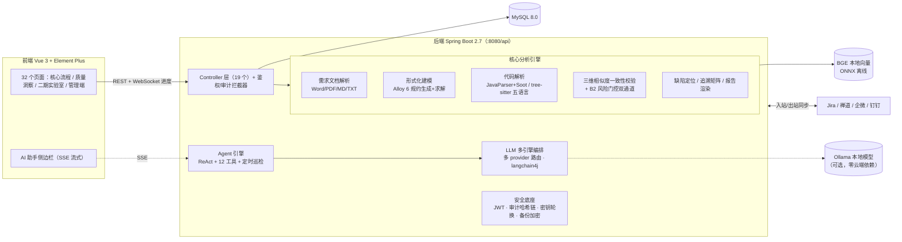

<div align="center">

# TraceGuard（规码同轨）

**基于形式化需求规约与大模型融合的软件需求-代码一致性验证与缺陷自动检测系统**

[](https://github.com/Tsuki0102/TraceGuard/actions/workflows/ci.yml)


大学生创新训练计划项目 · 2026 第八届全球校园人工智能算法精英大赛（2026AIC）参赛作品

</div>

---

## ⚡ 评审快速体验（10 分钟）

> 完整步骤见《[评审快速体验指南](docs/04-手册/评审快速体验指南.md)》。

```powershell
# 1) 配置密钥（首次）：复制 .env.example 为 .env，填入 4 个必填密钥
# 2) 启动（Docker 方式）：
docker compose up -d
# 3) 预置真实演示数据（电商订单示例工程，真实分析约 1-2 分钟）：
powershell -ExecutionPolicy Bypass -File scripts\demo-seed.ps1 -BaseUrl http://localhost:8080 -FrontendUrl http://localhost
# 4) 浏览器打开 http://localhost ，账号 demo / demo12345
```

## 目录

- [项目概述](#项目概述) · [系统架构](#系统架构) · [核心算法](#核心算法说明) · [评测结果](#评测结果摘要)
- [快速开始](#快速开始)（[Docker](#方式一docker一键评审环境) / [本地开发](#方式二本地开发) / [Windows 一键部署](#方式三windows-一键部署aud-12)）
- [AI 智能体](#ai-智能体agent) · [多语言支持](#多语言支持t11) · [大模型配置](#大模型llm配置)
- [扩展指南](#扩展指南多语言--多形式化语言aud-10) · [CI 与仓库](#代码仓库与-ci) · [项目结构](#项目结构) · [文档导航](#文档导航) · [FAQ](#常见问题faq)

## 项目概述

本系统面向中小软件企业敏捷开发场景与高校软件工程教学科研场景，聚焦软件开发全流程中「需求与代码不一致」的核心痛点，融合形式化需求规约的严谨性与大语言模型的语义理解能力，实现六大核心能力：

1. **自然语言需求自动化形式化建模** — 支持 Word/PDF/Markdown/TXT 格式需求文档自动解析，基于 Kripke 语义模型进行结构化提取，自动生成 Alloy 形式化规约并真实求解校验
2. **多语言代码静态解析与语义提取** — Java 走 JavaParser AST + Soot 字节码级 CFG；**Python / C / C++ / Go 走 tree-sitter 解析链路**，提取方法级语义单元并生成逻辑描述，检测 SQL 注入、资源泄露、死循环等各语言特有基础缺陷
3. **需求-代码多维度一致性校验** — 基于三维相似度公式（语义相似度+约束匹配度+不变量满足度）与 **B2 风险门控双通道**进行一致性判定，每次判定可溯源
4. **缺陷自动定位与双向追溯** — 自动识别需求缺失、代码超范围、逻辑不一致等缺陷类型，生成需求-代码双向追溯矩阵与可导出报告（Word/Excel/PDF）
5. **AI 智能体（Agent）** — ReAct 多轮工具调用智能体，SSE 流式对话、高危操作人机协同确认、每日定时质量巡检，12 个内置工具覆盖查询/诊断/处置
6. **可视化全流程管理平台** — 项目创建、文档/代码上传、分析执行、质量洞察、阈值实验室、评测中心、审计哈希链、备份恢复、第三方集成（Jira/禅道/企微/钉钉）一站式的 32 页面管理端

## 系统架构



## 核心算法说明

### 一致性校验：三维相似度 + 风险门控双通道

**Sim(Ri,Cj) = α·Cos(EmbR,EmbC) + β·Con(Ri,Cj) + γ·Inv(Ri,Cj)**

| 维度 | 默认权重 | 含义 |
|---|---|---|
| α 语义相似度 | **0.5** | Embedding 向量余弦（本地 BGE ONNX 离线可用）+ 分词 Jaccard + 方法名匹配增强 |
| β 约束匹配度 | **0.2** | 空值校验、参数验证、异常处理、日志记录等约束实现检测 |
| γ 不变量满足度 | **0.3** | 返回值、语法正确性、访问修饰符等不变量 |

> 权重与阈值来自 2026-09-03 的 B2 标定（A2 去共线性 + 风险门控网格寻优，tune 集 55 对），标定过程见《[阈值标定报告](docs/03-报告/阈值标定报告.md)》。

**判定规则（对齐 SRS FR-CHECK-002，代码实现见 `DefectMatcher.determineStatus`）**：

- 分数通道：Sim > T1（默认 **0.52**，严格大于）→ 完全一致；T2（默认 **0.5**）≤ Sim ≤ T1 → 一般不一致；Sim < T2 → 严重不一致
- 风险通道（B2 双通道）：独立风险分 defectRisk ≥ 风险门控（默认 **0.35**）时，即使分数落在一致区也判不一致——独立风险信号覆盖线性分数通道的漏检
- 阈值均可在管理端「阈值实验室」在线调整并标定

### 缺陷类型分类（FR-CHECK-003 四类口径）

1. **需求缺失**：需求条目在代码中未找到对应实现
2. **代码超范围实现**：代码方法未对应到任何需求条目（带负例抑制：与需求最大相似度 ≥ 0.5 不判超范围，降低误报）
3. **业务逻辑不一致**：语义相似度较低，实现逻辑与需求描述偏差大
4. **约束条件不满足**：需求中的约束条件（参数校验、空值检查等）未实现

### 支持的代码基础缺陷检测

内置静态模式检测器（随版本持续扩充），各语言信号详见 [多语言支持](#多语言支持t11)：

- SQL 注入风险、逻辑死循环（`while(true)` 无退出）、资源未释放（未用 try-with-resources/finally 关闭流）
- 空 catch 块吞异常、`Optional.get()` 未保护、`Map.get()` 链式未判空
- 数组越界风险（循环 `i<=length` 差一、固定下标 `get(size())`、空集合 `get(0)`）、比较器违反传递性约定等

量化结果见《[评测报告-综合](docs/03-报告/评测报告-综合.md)》FUN-05 基础代码缺陷章节（小样本 TP=10/FP=0/FN=0）。

## 评测结果摘要

> 数据底座：一致性标注集 5 域 **116 对**（tune 55 + hold-out 61），双评 κ=0.8016；完整口径见《[评测报告-综合](docs/03-报告/评测报告-综合.md)》与《[消融与同类对比实验报告](docs/03-报告/消融与同类对比实验报告.md)》。

| 指标 | SRS 验收线 | tune 集（55 对，扩容复测） | hold-out 盲评（61 对） |
|---|---|---|---|
| 缺陷检测准确率 | ≥ 80% | **94.5%** | **95.0%** |
| 漏检率 | ≤ 15% | **3.8%** | **0.0%** |
| 误报率 | ≤ 10% | **6.9%** | **7.3%** |

- 首测批次（2026-08-27，qwen2.5-coder:14b + FUN-04b 双判定管线）：96.4% / 3.8% / 3.4%，SRS 三项指标首次全达标
- 规则链兜底（**无 LLM** 也可交付）：阈值标定后 tune 70.9%（误报 0.0%）
- 消融证据链：纯规则默认阈值 47.3%（误报 100%）→ 标定后 70.9% → 单提示词 LLM 81.8% → 云端 qwen-max 83.6% → **本方案双判定管线 95.0%+**（八口径 A1-A8 全表见消融报告）
- 性能（规则链路，千行 kilo / 万行 tenk 双基准）：全量 1.97s / 27.8s；增量二次分析 **-76%**（kilo 6.0s）；72h 冒烟、并发达标
- 同类对比：SonarQube 类静态扫描无需求对齐、纯 LLM Review 误报 27.6% 且不可审计——本方案以「形式化锚定 + 双提示词交叉 + 规则仲裁 + 数值过滤」系统性解决（对比表见消融报告）

## 快速开始

### 环境要求

- JDK 21、Maven 3.8+、Node.js 20 LTS（与 CI / Dockerfile 口径一致）
- MySQL 8.0（Docker 方式无需本机安装）

### 方式一：Docker 一键（评审环境）

见上方「[评审快速体验（10 分钟）](#-评审快速体验10-分钟)」；`docker compose up -d` 拉起 MySQL + 后端 + 前端（nginx :80），后端健康检查通过后前端才对外就绪。密钥（`JWT_SECRET` 等 4 项）无默认回退，缺失即拒绝启动（fail-fast）。

### 方式二：本地开发

需先安装 MySQL 8.0 并创建数据库 `traceguard`（utf8mb4），执行 `backend/src/main/resources/sql/init.sql` 初始化（幂等 DDL）。

```bash
# 后端（http://localhost:8080/api，API 文档 /api/doc.html）
cd backend
mvn clean package -DskipTests
mvn spring-boot:run

# 前端（http://localhost:3000）
cd frontend
npm install
npm run dev
```

默认账号 **admin / admin123**（登录后请尽快修改）。

### 方式三：Windows 一键部署（AUD-12）

Windows 10/11 原生环境（无需 Docker Desktop），两种方式并存，Docker 方式不受影响：

1. **前置安装**（均需加入系统 Path）：JDK 21+、Maven 3.8+、MySQL 8.0+、Node.js 20 LTS+。
2. 在项目根目录执行：
   ```powershell
   powershell -ExecutionPolicy Bypass -File scripts\deploy-windows.ps1 -MysqlUser root -MysqlPass '你的密码'
   ```
   脚本按序完成：前置检查 → 数据库初始化（幂等，库已存在则跳过）→ 后端构建 → 前端构建 → 生成启动脚本。
3. 启动：双击生成的 `start-all.bat`（并行拉起前后端并打开浏览器），或分别双击 `start-backend.bat` / `start-frontend.bat`。
   - 后端：`http://localhost:8080/api`（prod 配置，日志 `logs/traceguard.log`）
   - 前端：优先 nginx（`frontend\nginx-windows.conf`，端口 80）；未安装 nginx 时自动降级 `npx vite preview --port 3000`

| 参数 | 说明 | 默认值 |
|---|---|---|
| `-MysqlUser` | MySQL 用户名 | `root` |
| `-MysqlPass` | MySQL 密码（缺省时交互提示输入） | 空 |
| `-SkipBuild` | 跳过前后端构建（仅生成启动脚本） | 关闭 |

> 脚本幂等可重跑；已构建产物与已初始化数据库会自动跳过。另有 Inno Setup 打包脚本 `scripts/build-installer.ps1` 可产出安装包。

### 使用流程

1. **登录系统** — 默认 admin/admin123（或评审环境 demo/demo12345）
2. **创建项目** — 在工作台或项目列表页创建新项目（技术栈选 Java/Python/C++/C/Go，自动路由解析器）
3. **上传需求文档** — 支持 .docx/.pdf/.md/.txt
4. **上传代码工程** — 对应语言工程打包 ZIP 上传（Java 为 Maven/Gradle 工程）
5. **配置参数** — 调整权重系数和判定阈值（使用默认值即可）
6. **启动分析** — 一键执行全流程自动化分析（WebSocket 实时推送进度）
7. **查看结果** — 统计图表、需求/代码分析、缺陷报告、判定溯源、双向追溯矩阵、五类格式导出

## AI 智能体（Agent）

三期新增的质量巡检智能体（提交 `1b65ba8`），代码位于 `backend/.../agent/`，前端为全局「AI 助手」侧边栏（`AiAssistant.vue`）：

- **ReAct 多轮工具调用**：12 个内置工具——`list_projects` / `get_overview` / `get_trend` / `query_defects` / `query_requirements` / `query_consistency` / `list_tasks` / `search` / `explain_defect` / `get_patterns` / `update_defect_status` / `rerun_analysis`
- **SSE 流式对话**：`POST /api/agent/chat/stream`，逐 token 推送思考与工具调用过程；`/agent/reset` 重置会话
- **人机协同（human-in-the-loop）**：写操作（如重跑分析、修改缺陷状态）先返回「待确认」动作，经 `/agent/confirm` 人工确认后才真正执行
- **定时巡检**：`AgentPatrolJob` 按 cron 定时自动巡检项目质量并生成报告（默认关闭；`AGENT_PATROL_ENABLED=true` 开启，`AGENT_PATROL_CRON` 默认 `0 0 9 * * ?` 每日 9 点；管理员手动触发不受开关限制）
- **模型路由**：`llm.routing.agent` 默认指向本地 `codellama`（Ollama，模型 `qwen2.5-coder:14b`）；路由缺失时自动回退 `code-explain` 环节

## 多语言支持（T11）

解析层基于 **tree-sitter（JVM 绑定）** 扩展为五语言（2026-09-21 收官），创建项目时填写技术栈即自动路由，全流程（一致性校验/缺陷定位/追溯矩阵/报告导出）与 Java 工程完全一致：

| 语言 | 解析器 | CFG 构建 | 特色缺陷信号 | 示例工程 |
|---|---|---|---|---|
| Java | JavaParser AST + Soot 4.7.0 字节码级 CFG（含异常边、编译降级链） | Soot | 注入/死循环/资源泄露等通用 + Java 特有 | [samples/ecommerce-order](samples/ecommerce-order/) 等 3 个 |
| Python | `PythonCodeParser`（tree-sitter-python） | `PythonCfgBuilderUtil` | 5 类 Python 特有信号 | [samples/python-inventory](samples/python-inventory/) |
| C / C++ | `CFamilyCodeParser` 基类 + `CCodeParser` / `CppCodeParser`（tree-sitter-c/cpp） | `CFamilyCfgBuilderUtil`（do-while/switch-case/goto/catch） | malloc 泄漏、危险函数 CWE-120、fopen 句柄泄漏、malloc 未判空、裸 catch | [samples/cpp-loglib](samples/cpp-loglib/)（C++ 类 + 纯 C 混编） |
| Go | `GoCodeParser`（tree-sitter-go，receiver 归属方法） | `GoCfgBuilderUtil`（for-switch） | 错误未处理、错误被 `_` 丢弃、资源/锁未释放、panic 滥用 | [samples/go-taskrunner](samples/go-taskrunner/) |

每种语言均有独立单元测试（各 6 项）与 E2E 实测记录；多语言样例工程一览见 [samples/README.md](samples/README.md)。

## 大模型（LLM）配置

系统的大模型能力属于**可选增强，默认关闭**，开箱即用无需任何 LLM 配置：

- **默认状态**：`enabled=false`。未配置时所有大模型相关功能（语义增强解释、缺陷智能解释、修复建议、Agent 对话）自动降级为规则实现，不影响需求-代码一致性校验主流程
- **如何开启**（管理员）：「系统设置 → LLM 配置」→ 打开「启用大模型」→ 选择 provider（`deepseek` / `glm` / `qwen` / `codellama` 本地模型）→ 填写 `baseUrl` 与 `apiKey` → 保存并「测试连通性」
- **配置模板**：复制 `.env.example` 为 `.env` 填入真实密钥（该文件不含任何真实密钥）；关键变量：`LLM_ENABLED` / `LLM_PROVIDER` / `LLM_BASE_URL` / `LLM_API_KEY` / `LLM_ENGINE`
- **引擎切换**：`engine: self`（OpenAI 兼容客户端，默认）/ `engine: langchain`（langchain4j 编排，异常自动回退 self，主流程不中断）
- **本地化运行**：本地 BGE ONNX 离线向量化 + Ollama 本地模型即可**全程数据不出域**跑通全链路，详见《[本地大模型部署指南](docs/04-手册/本地大模型部署指南.md)》（含 Ollama 安装、Windows 路径设置、qwen2.5-coder 实测结论）
- **安全提示**：`apiKey` 仅存储于服务端（前端接口已脱敏，表内加密存储 `LLM_CONFIG_KEY`），请勿将真实密钥提交至版本库

## 扩展指南（多语言 / 多形式化语言，AUD-10）

系统解析层与规约层抽象为 SPI 接口，五语言（Java/Python/C/C++/Go）已内置，接入新语言无需改动主流程：

- **代码解析**：实现 `com.traceguard.spi.CodeParser`（`language()` 返回语言标识），注册为 Spring `@Component`，即可被 `ParserRegistry` 自动索引；多语言实现可参考 `CFamilyCodeParser`（C/C++ 共用抽象基类）模式
- **规约生成/校验**：实现 `com.traceguard.spi.SpecGenerator` / `SpecVerifier`（如接入 TLA+），由 `SpecRegistry` 索引
- **切换语言**：`application.yml` 中 `traceguard.analysis.code-language` / `spec-language`（默认 `java` / `alloy`）；配置了无实现的语言时启动分析会抛出 `BusinessException` 并列出可用语言
- **规模上限**：性能基准与批量解析线程数可在 `traceguard.perf` 调整（万行级 27.8s 实测见性能基准报告）

## 代码仓库与 CI

- **远程仓库**：GitHub 私有仓库 https://github.com/Tsuki0102/TraceGuard （SSH: `git@github.com:Tsuki0102/TraceGuard.git`）
- **CI 流水线**（`.github/workflows/ci.yml`，推 `master`/`main` 或 PR 自动触发，4 个 job）：
  1. **Compliance Scan** — 公平性合规扫描（材料不得含学校/教师等标识信息）
  2. **Secret Scan** — gitleaks 密钥扫描（携带密钥即阻断）
  3. **Backend** — JDK 21 + MySQL 8.0 service，`mvn test` 全量单测 + JaCoCo 覆盖率 artifact
  4. **Frontend** — `npm ci && npm run build`
- OWASP dependency-check 已就绪但需仓库 Secrets 配置 `NVD_API_KEY` 后启用（当前临时禁用）
- **本地开发约定**：PDF 导出测试（`ExportServiceTest`）标注 `@EnabledOnOs(OS.WINDOWS)`，CI Linux runner 自动跳过（依赖中文字体），本地 Windows 仍全量覆盖

## 项目结构

```
TraceGuard/
├── backend/                    # 后端 Spring Boot 2.7（19 控制器 / 18 实体 / 33 工具类）
│   └── src/main/java/com/traceguard/
│       ├── agent/              # AI 智能体：ReAct 会话 / 12 工具 / 人机确认 / 定时巡检
│       ├── common/ config/     # 通用响应、配置类（CORS、MyBatis-Plus、Knife4j、阈值 Holder 等）
│       ├── controller/         # REST 层（含 Agent、分片上传、导出、备份、审计、WS 票据等 19 个）
│       ├── core/               # ConsistencyChecker（三维相似度+风险门控）、DefectMatcher、DefectTypes
│       ├── entity/ dto/ mapper/  # 数据层（tg_* 表 18 实体）
│       ├── integration/        # Jira/禅道/企微/钉钉 客户端 + 入站同步
│       ├── interceptor/ llm/   # 登录/审计拦截器；LLM 编排（多 provider 路由、langchain4j 适配）
│       ├── service/            # 业务层（分析/一致性判定/导出/备份/洞察/巡检… + report/ 渲染）
│       ├── spi/                # 扩展点：CodeParser/SpecGenerator/SpecVerifier + Registry
│       │                       #   五语言解析器：Java / Python / C / C++ / Go（tree-sitter）
│       ├── task/ util/ websocket/  # 定时任务、33 工具类、WS 进度推送（一次性票据）
│   └── src/main/resources/
│       ├── application.yml（dev 默认） / application-dev.yml / application-prod.yml
│       └── sql/init.sql        # 数据库初始化（幂等 DDL）
├── frontend/                   # 前端 Vue 3 + Vite + Element Plus（32 页面）
│   └── src/{views,components,api,router,utils}   # 含 AiAssistant 智能体侧边栏、判定溯源面板
├── docs/                       # 全部文档（5 类，入口见 docs/README.md）
│   ├── 01-需求与申报/ 02-设计与跟踪/ 03-报告/ 04-手册/ 05-参赛材料/
├── samples/                    # 评测样例工程：Java×3 + Python/C/C++/Go×1 + benchmark(kilo/tenk) + dataset 标注集
├── demo-cases/                 # 演示用例（考勤/库存/图书）+ tools 自动填充脚本
├── integration-mock/           # Jira/禅道/企微/钉钉 集成 Mock 服务
├── models/                     # bge-small-zh-v1.5 本地向量模型（ONNX）
├── scripts/                    # 运维与评测脚本（deploy-windows / demo-seed / smoke72h / llm-judge-lab 判定实验等 30+）
├── backups/                    # 本地备份导出（gitignore）
├── docker-compose.yml / .env.example / .github/workflows/ci.yml
```

## 文档导航

全部文档已归类至 [docs/](docs/README.md)（含逐份导读与阅读路径建议）：

| 目录 | 内容 |
|---|---|
| [01-需求与申报](docs/01-需求与申报/) | 软件需求规格说明书 V1.1、大创申报表（脱敏版） |
| [02-设计与跟踪](docs/02-设计与跟踪/) | 整体设计方案、技术白皮书 V1.2、**差距与改进编号台账**（GAP/AUD 唯一权威）、2026AIC 冲奖跟进清单 |
| [03-报告](docs/03-报告/) | 评测综合报告、消融与同类对比、阈值标定、性能基准（kilo/tenk/F3）、增量分析 B3、可靠性、测试汇总 F2、引用清单 E2 等 15 份 |
| [04-手册](docs/04-手册/) | 用户操作手册、部署手册、评审快速体验指南、本地大模型部署指南、项目理解手册 |
| [05-参赛材料](docs/05-参赛材料/) | 2026AIC 答辩 PPT 全案、演示视频口播稿与录制文档 |

## 支持的浏览器（GAP-042 / SRS 5.5.2）

| 浏览器 | 最低版本 |
|---|---|
| Google Chrome | 100 |
| Microsoft Edge | 100 |
| Mozilla Firefox | 100 |

构建产物经 `autoprefixer` 自动补全 CSS 前缀，以 `chrome100,edge100,firefox100` 为目标编译（见 `frontend/.browserslistrc`、`vite.config.js`）。更低版本可能出现样式或语法兼容问题，建议升级后使用。

## 常见问题（FAQ）

- **端口冲突**：8080/3000 被占用时，改 `application-prod.yml`（`server.port`）与 `vite.config.js`（`server.port`）。
- **数据库连接失败**：确认 MySQL 已启动、密码正确；可用 `MYSQL_USER`/`MYSQL_PASSWORD` 等环境变量覆盖配置。
- **生产密钥加固（SEC-02/03）**：`prod` 下 `JWT_SECRET` / `STORAGE_ENCRYPT_KEY` / `BACKUP_ENCRYPT_KEY` / `LLM_CONFIG_KEY` **无默认回退，未注入即拒绝启动**（fail-fast）；开发环境（dev）可沿用内置默认值但启动时有 WARN 告警。
- **JDK/MySQL/Node 提示未找到**：确认已加入系统 Path 后重开 PowerShell 再执行部署脚本。
- **LLM 相关功能不生效**：检查「系统设置 → LLM 配置」`enabled` 状态与连通性测试；本地模型（Ollama）`api-key` 留空即可，详见《[本地大模型部署指南](docs/04-手册/本地大模型部署指南.md)》。
- **其他注意事项**：
  1. 数据库统一使用 MySQL 8.0（开发/测试/生产一致），启动前先执行 `init.sql` 初始化。
  2. 代码控制流图（CFG）基于 Soot 4.7.0 真实字节码分析构建（含异常边、编译降级链与 Java 8/11/17 分版本适配），非简化实现（详见《[技术白皮书](docs/02-设计与跟踪/技术白皮书.md)》）。
  3. 上传文件存储在 `./uploads/` 目录下。

## 引用与致谢

本项目使用的开源组件与引用清单（JavaParser、Soot、Alloy、tree-sitter、langchain4j、BGE、Hutool 等）统一登记于《[引用与知识产权清单-E2](docs/03-报告/引用与知识产权清单-E2.md)》。

## 许可

本项目为大学生创新创业训练计划项目暨 2026AIC 参赛作品，版权归项目团队所有，未授予开源许可；如需学习交流请通过仓库 issues 联系。
