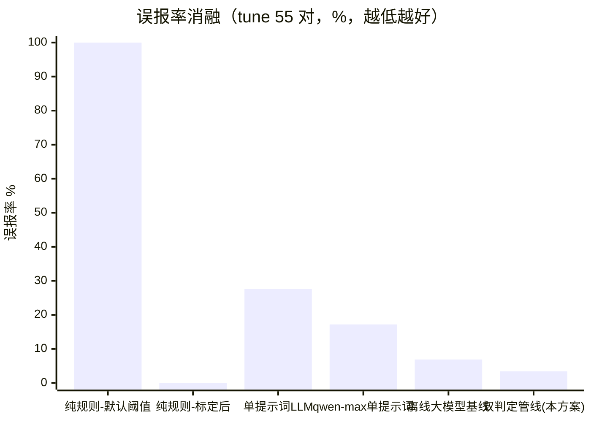

# 消融与同类对比实验报告

> 编制日期：2026-09-21
> 性质：**数据整合报告**——全部数字取自已落盘的实测报告（见各表"来源"列），未新跑实验；所有口径均可按《评测数据集标注规范与治理说明》第 7 节命令复现
> 用途：作品方案"技术架构与创新/创新应用"节与答辩 PPT"消融/对比实验"页的统一数据底座
> 数据底座：一致性标注集 in-scope 55 对（tune）+ 61 对 hold-out 验证集（A4 扩容，2026-09-03）

---

## 一、消融对比实验（同一评测集上的判定策略演进）

### 1.1 数据总表

| # | 判定方案 | 判定引擎 | 数据口径 | 准确率 | 漏检率 | 误报率 | 来源 |
|---|---|---|---|---|---|---|---|
| A1 | 纯规则（默认阈值 t1=0.80） | 无 LLM | tune 55 对 | 47.3% | 0.0% | 100.0% | 《评测报告-综合》FUN-01 并列对比 |
| A2 | 纯规则（阈值标定最优 t1=0.52） | 无 LLM | tune 55 对 | 70.9% | 61.5% | 0.0% | 《阈值标定报告》三 |
| A3 | 单提示词 LLM（单判定直出） | LLM（2026-08-26 批次） | tune 55 对 | 81.8% | 7.7% | 27.6% | 《评测数据集标注规范与治理说明》§9 |
| A4 | 单提示词 LLM（云端大模型） | qwen-max | tune 55 对 | 83.6% | 15.4% | 17.2% | 《技术白皮书》§6 |
| A5 | 单提示词 LLM（弱模型） | CodeLlama | tune 55 对 | 61.8% | 0.0% | 72.4% | 《技术白皮书》§6 |
| A6 | 离线大模型逐条判定基线 | LLM（55/55 成功） | tune 55 对 | 92.7% | 7.7% | 6.9% | 《评测数据集标注规范与治理说明》§7 |
| **A7** | **双判定管线（本方案主口径）**：变体A 全量准则+分工/常量证据注入 × 变体B 精简五条+结构化示例**交叉验证**，分歧时**规则风险仲裁**，叠加**数值归属硬过滤**与量化边界规则否决权 | 本地 qwen2.5-coder:14b | tune 55 对 | **96.4%** | **3.8%** | **3.4%** | FUN-04b，2026-08-27，《评测报告-综合》 |
| **A8** | **双判定管线（hold-out 盲评）** | 同上 | validation 61 对（纯 hold-out） | **95.0%** | **0.0%** | **7.3%** | A4 扩容复测 2026-09-03，双评 κ=0.8016 |

> 口径说明：① 漏检率=FN/(TP+FN)、误报率=FP/(TP+FP)、准确率=(TP+TN)/总数；② A1–A6 与 A7 同为 in-scope 标注对判定，A8 为扩容后从未参与调参的 hold-out 验证集盲评，κ=0.8016（好一致性）；③ 各基线批次引擎与温度详情见对应源报告。

### 1.2 准确率对比

```mermaid
xychart-beta
    title "缺陷检测准确率消融（tune 55 对，%）"
    x-axis ["纯规则-默认阈值", "纯规则-标定后", "单提示词LLM", "qwen-max单提示词", "离线大模型基线", "双判定管线(本方案)"]
    y-axis "准确率 %" 0 --> 100
    bar [47.3, 70.9, 81.8, 83.6, 92.7, 96.4]
```

### 1.3 误报率对比



### 1.4 消融结论（答辩叙事线）

1. **纯规则不可用**：默认阈值下误报 100%（全判缺陷），阈值标定到最优后误报 0% 但漏检 61.5%——规则与阈值此消彼长，存在天花板（A1→A2）。
2. **换大模型提升有限**：单提示词从本地小模型（81.8%）换到云端 qwen-max（83.6%）仅 +1.8 个百分点，误报仍 17.2%——**瓶颈在判定方法而非模型规模**（A3→A4）；弱模型单提示词更不可用（A5）。
3. **本方案以本地小模型超越云端大模型单提示词 12.8 个百分点**（96.4% vs 83.6%），误报 3.4% 为全表最低——双提示词交叉验证 + 规则仲裁 + 数值归属过滤的**结构性收益**，且全程本地运行、无数据出域（A7/A8）。
4. **hold-out 盲评可信**：61 对纯 hold-out 上 95.0%/0.0%/7.3%，与 tune 集差距 ≤1.4 个百分点，无过拟合迹象（A8）。

---

## 二、同类方案定位对比

> 对比对象基于其公开产品定位做定性对比；TraceGuard 列的量化数据来自本文第一节实测。

| 能力维度 | SonarQube / Checkmarx 类静态扫描 | 纯 LLM Code Review（Copilot 类 / 直接对话大模型） | 通用 AI 助手（需求+代码一次性丢给大模型） | **TraceGuard（本方案）** |
|---|---|---|---|---|
| 核心定位 | 代码侧质量/安全规则扫描 | 代码片段评审建议 | 一次性问答，无流程 | 需求-代码一致性验证与缺陷检测全流程平台 |
| 需求-代码对齐 | **不具备**（无需求侧输入） | 无系统化对齐，依赖人工粘贴 | 无对齐机制，长上下文易丢失 | 需求条目 × 代码方法**对齐矩阵 + 双向追溯** |
| 形式化锚定 | 无 | 无 | 无 | 需求自动生成 **Alloy 形式化规约**（45 对转换对照集校验） |
| 判定可审计性 | 规则可解释，但无需求语义 | 黑盒输出，幻觉无法溯源，无留痕 | 同左，且无持久化 | **判定溯源面板**（每对判定可查证据）+ 审计日志**哈希链防篡改** |
| 误报控制（口径见 §1.1） | 规则误报靠人工关停维护 | 实测单提示词误报 27.6%（A3），云端大模型 17.2%（A4） | 无量化口径 | **3.4%**（双提示词交叉 + 规则仲裁 + 数值过滤，A7） |
| 数据本地化 | 支持私有部署 | 主流为云端 SaaS，代码出域 | 云端，代码出域 | **全程本地可运行**（本地 BGE 嵌入 + 本地 Ollama 模型即可跑通全链路） |
| 规模化效率 | 快（纯静态），但仅代码侧 | 逐片段人工发起，不可批量 | 不可批量、不可复现 | 规则链路 1 万行 **27.77s**；LLM 增强**候选复核预算制**（≈200 对 ≈12min @RTX 4060） |

### 对比结论

- 静态扫描工具解决"代码对不对"，**不解决"代码做的是不是需求要的"**——需求-代码对齐是本方案与全部同类产品的本质分界；
- 纯 LLM 方案的误报与不可审计性被本方案的结构化管线系统性解决（A3 vs A7：误报 27.6%→3.4%，且每次判定可溯源）；
- 本方案在"数据不出域"约束下达到超过云端大模型的精度，适配外包验收、涉密单位、高校教学等对数据本地化敏感的场景。

---

## 三、使用建议（材料嵌入指引）

- 作品方案"（二）技术架构与创新 → 创新应用"：嵌入 §1.1 总表 + §二 对比表；
- 答辩 PPT：新增/替换一页"消融实验"（§1.2/§1.3 图）+ 一页"同类对比"（§二 表精简版）；
- 答辩口径一句话：**"瓶颈在方法不在模型——同样用本地 14B 小模型，双提示词交叉加规则仲裁比单提示词准确率提升 14.6 个百分点、误报降到 3.4%，超过云端 qwen-max 单提示词 12.8 个百分点。"**
